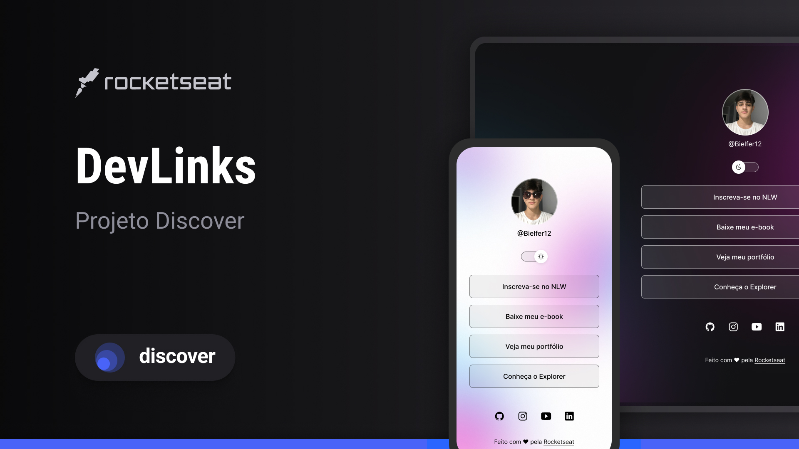

<h1 align="center"> 🚀 Página de Links - Discover 🚀 </h1>

Olá, Tudo certo? Bom, este é um projeto desenvolvido junto a um curso de desenvolvimento Web e Git/GitHub,  aonde é proposto fazer uma ´página de links pessoal, para usar como metodo profissional tambem.  

  <a href="#-tecnologias">Tecnologias</a>&nbsp;&nbsp;&nbsp;|&nbsp;&nbsp;&nbsp;
  <a href="#-projeto">Projeto</a>&nbsp;&nbsp;&nbsp;|&nbsp;&nbsp;&nbsp;
  <a href="#-layout">Layout</a>&nbsp;&nbsp;&nbsp;|&nbsp;&nbsp;&nbsp;
  <a href="#memo-licença">Licença</a>

  

 

  

<h1> 📚 Linguagens Usadas </h1>

Como o intuito do curso era ser um aprendizado em desenvolvimento web as seguintes linguagens usadas são:

<ul>
  <li>HTML</li>
  <li>CSS</li>
  <li>JavaScript</li>
<ul>
<h1>🔨 Ferramentas Usadas:</h1>  
<ul>
  <li>Visual Studo Code</li>
  <li>Git</li>
   <li>GitHub</li>
</ul>
  
## 💻 Projeto

O DevLinks é um agregador de links para usar como cartão de visitas online.

- [Acesse o projeto finalizado, online](#)

## :memo: Licença

Esse projeto está sob a licença MIT.

