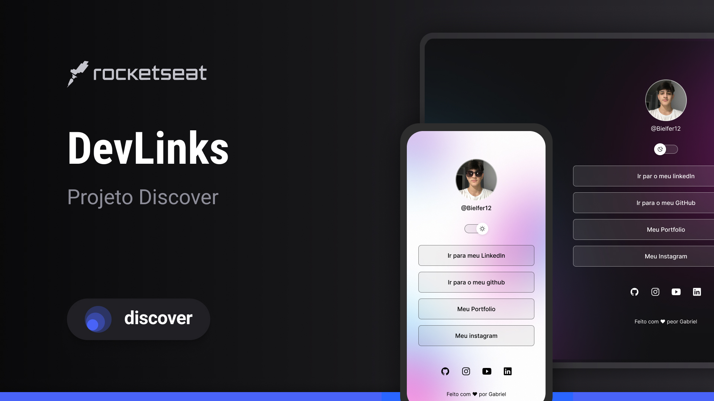

<h1 align="center"> 🚀 Página de Links - Discover 🚀 </h1>

Olá, Tudo certo? Bom, este é um projeto desenvolvido junto a um curso de desenvolvimento Web e Git/GitHub,  aonde é proposto fazer uma ´página de links pessoal, para usar como metodo profissional tambem.  

  <a href="#-tecnologias">Tecnologias</a>&nbsp;&nbsp;&nbsp;|&nbsp;&nbsp;&nbsp;
  <a href="#-projeto">Projeto</a>&nbsp;&nbsp;&nbsp;|&nbsp;&nbsp;&nbsp;
  <a href="#-layout">Layout</a>&nbsp;&nbsp;&nbsp;|&nbsp;&nbsp;&nbsp;
  <a href="#memo-licença">Licença</a>

  

 

  

<ul>
<h1>🔨 Ferramentas Usadas:</h1>  
<ul>
  <li>Visual Studo Code</li>
  <li>Git</li>
   <li>GitHub</li>
</ul>

<h1>📚 Linguagens Usadas:</h1>
 <ul>
  <li>HTML</li>
  <li>CSS</li>
  <li>JavaScript</li>
</ul>

<h1>😃 Sobre o Projeto!!</h1>

<b>📑 HTML</b>
--> Hyper Text Markup Language ou Linguagem de Marcação(HTML)

Sobre o <b>HTML</b>, teve bastante ensinamente, desde, a estrutua inicial da HTML, UTF-8, mudanças , etc, também sobre as tags, id ,Div, Class, Element, A, P, IMG, B, entre muitas outras que foram ensinadas ao longo do curso, estruturação com id, como fazer uma estrutua que adentre e fique de forma correta dentro da página.

<b>📠CSS</b>
--> Cascading Style Sheet ou Folha de Estilo em Cascata(CSS)

Sobre o <b>CSS</b>, estudei sobre os diversos tipos de declarações, como background, padding, margin ,transition, color, display entre muitos outros. Também sobre os pseudo-elementos, como o hover, sobre os diversos tipos de resolução e como adentrar a dispostivos especificos, para que a página fique de forma certa. Como adentrar o código CSS ao HTML, também como linkar os dois.

<b>🟨 JS</b>
--> Java Script (JS)

Sobre o <b>JS</b>, foram ensimentos basicos, como const e função, e um pouco da sintaxe que é usada dentro do JS, pois é uma linguagem de programção diferente do CSS e HTML. Mas foi feito para fazer a troca de background, de night para light e vice e versa.

<b>👾 GIT e GitHub</b>

Sobre o <b>GIT E GitHub</b>,eles são usadas de forma conjunta para que o projeto seja adentrado dentro de um repositorio, pelo terminal do VS code. Teve ensinamentos de sintaxe como git init, git push, git commit, entre outros para que consigo botar o projeto dentro do github, e o github, é uma plataforma/rede social aonde pode se ver esse projeto armazenado, como voce esta vendo agora!!

  

